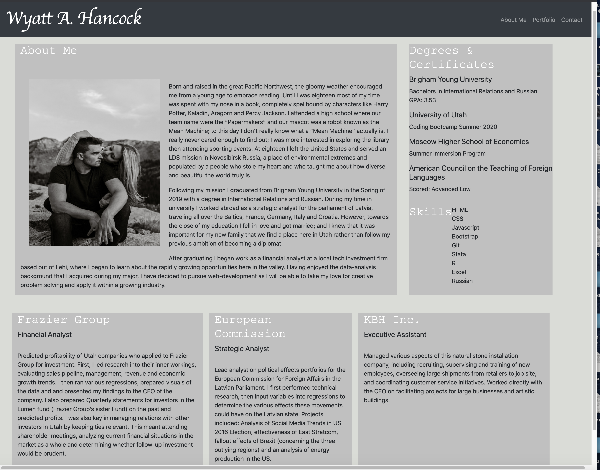
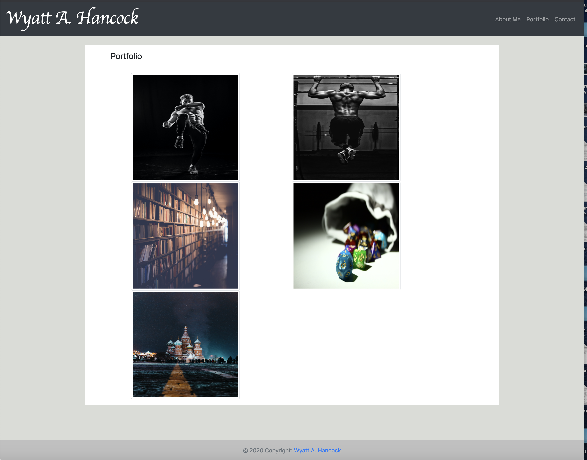
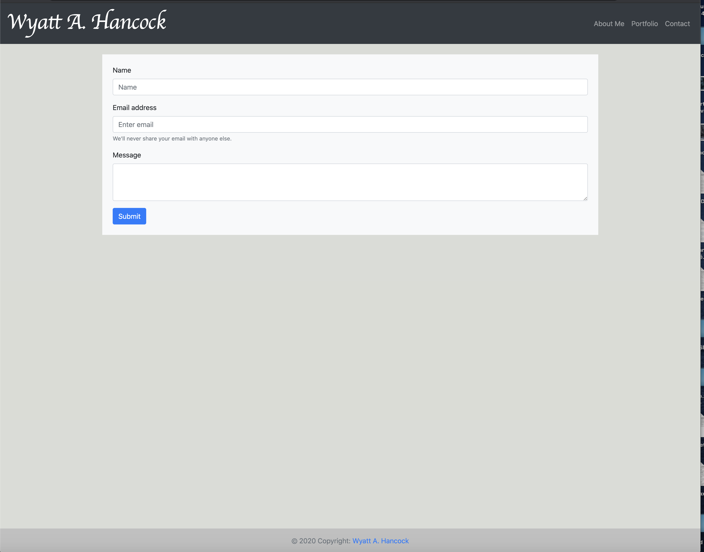

# Portfolio_Assignment  

# Purpose 
The purpose of this project was to create a responsive portfolio website that would look good on a large, medium, and small browser. I built this project so as to be able to apple the knowledge gained over the last two weeks and construct a website that could show my current capabilities. 

# Process 
* Using a pencil and paper, I created a mock-up for each of the html pages so that I could have a reference for what the pages should look like
* I then gave each of the html’s a proper title
* I then created a navigation bar (using bootstrap) for each page so that the site visitor could travel from page to page with ease. I then made the nav bar sticky so that the visitor will always see the nav bar. I also made sure that it was responsive so that it was always possible to use with any window size.
* Using Bootstrap, I created a container for each html, then created a series of rows and columns that would serve as a nice grid layout. After making sure that the containers were responsive, I filled them with the proper content, including responsive images (in the portfolio section I made sure that each image had a hyperlink that would take it to a corresponding website).
* Then using bootstrap, I then created a form on the contact html so that the visitor could contact the website owner. I also checked to make sure that this form was responsive. 
*Finally, I created a footer for each page so that proper credit would be given to the website owner. This was also checked for responsiveness. 

# Issues I Encountered 
* Without a doubt the most difficult thing I encountered was creating a pleasing layout using bootstrap while maintaining responsiveness. It took a ton of research and coordinating with TA's and tutors in order to get it to look correct. This occured predominately with the footer and the main containers. 
* The other issue that I encountered was learning how to coordinate css with bootstrap without negatively effecting one or the other. 

# What I Learned 
* How to create a responsive website
* How to coordinate css and bootstrap 
* How to use bootstrap to build pleasing containers
* How to properly formate a website 
* How to build responsive images 

# Link:
https://corvus-cyber.github.io/Portfolio_Assign2/

# Screenshot:

